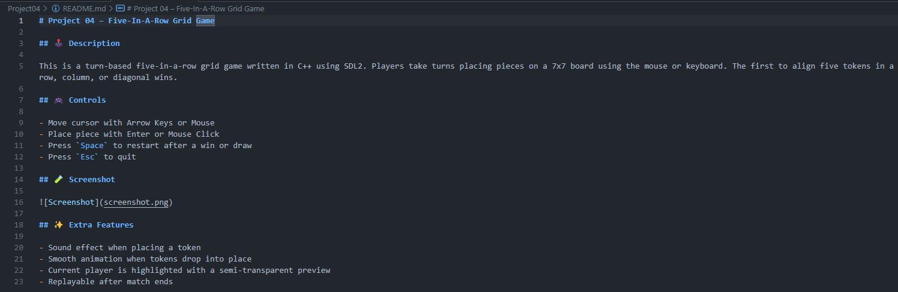

# Project 04 – Five-In-A-Row Grid Game

## 🕹️ Description

This is a turn-based five-in-a-row grid game written in C++ using SDL2. Players take turns placing pieces on a 7x7 board using the mouse or keyboard. The first to align five tokens in a row, column, or diagonal wins.

## 🎮 Controls

- Move cursor with Arrow Keys or Mouse
- Place piece with Enter or Mouse Click
- Press `Space` to restart after a win or draw
- Press `Esc` to quit

## 🧪 Screenshot

## ✨ Extra Features

- Sound effect when placing a token
- Smooth animation when tokens drop into place
- Current player is highlighted with a semi-transparent preview
- Replayable after match ends